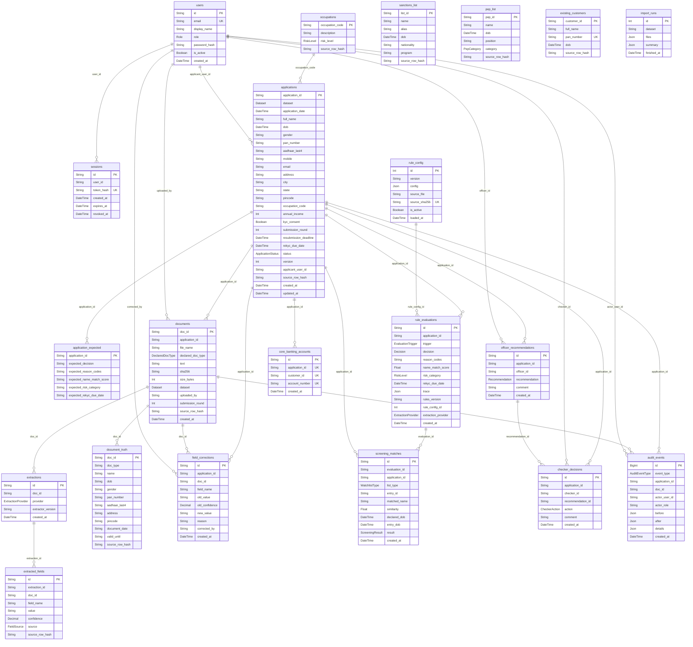

# ER diagram

Generated from `backend/prisma/schema.prisma`. `audit_events` is append-only (database trigger); `documents` is unique on (application_id, sha256).

```mermaid
erDiagram
  users {
    String id PK
    String email UK
    String display_name
    Role role
    String password_hash
    Boolean is_active
    DateTime created_at
  }
  sessions {
    String id PK
    String user_id
    String token_hash UK
    DateTime created_at
    DateTime expires_at
    DateTime revoked_at
  }
  rule_config {
    Int id PK
    String version
    Json config
    String source_file
    String source_sha256 UK
    Boolean is_active
    DateTime loaded_at
  }
  occupations {
    String occupation_code PK
    String description
    RiskLevel risk_level
    String source_row_hash
  }
  sanctions_list {
    String list_id PK
    String name
    String alias
    DateTime dob
    String nationality
    String program
    String source_row_hash
  }
  pep_list {
    String pep_id PK
    String name
    DateTime dob
    String position
    PepCategory category
    String source_row_hash
  }
  existing_customers {
    String customer_id PK
    String full_name
    String pan_number UK
    DateTime dob
    String source_row_hash
  }
  applications {
    String application_id PK
    Dataset dataset
    DateTime application_date
    String full_name
    DateTime dob
    String gender
    String pan_number
    String aadhaar_last4
    String mobile
    String email
    String address
    String city
    String state
    String pincode
    String occupation_code
    Int annual_income
    Boolean kyc_consent
    Int submission_round
    DateTime resubmission_deadline
    DateTime rekyc_due_date
    ApplicationStatus status
    Int version
    String applicant_user_id
    String source_row_hash
    DateTime created_at
    DateTime updated_at
  }
  application_expected {
    String application_id PK
    String expected_decision
    String expected_reason_codes
    String expected_name_match_score
    String expected_risk_category
    String expected_rekyc_due_date
  }
  documents {
    String doc_id PK
    String application_id
    String file_name
    DeclaredDocType declared_doc_type
    String text
    String sha256
    Int size_bytes
    Dataset dataset
    String uploaded_by
    Int submission_round
    String source_row_hash
    DateTime created_at
  }
  extractions {
    String id PK
    String doc_id
    ExtractionProvider provider
    String extractor_version
    DateTime created_at
  }
  extracted_fields {
    String id PK
    String extraction_id
    String doc_id
    String field_name
    String value
    Decimal confidence
    FieldSource source
    String source_row_hash
  }
  document_truth {
    String doc_id PK
    String doc_type
    String name
    String dob
    String gender
    String pan_number
    String aadhaar_last4
    String address
    String pincode
    String document_date
    String valid_until
    String source_row_hash
  }
  field_corrections {
    String id PK
    String application_id
    String doc_id
    String field_name
    String old_value
    Decimal old_confidence
    String new_value
    String reason
    String corrected_by
    DateTime created_at
  }
  rule_evaluations {
    String id PK
    String application_id
    EvaluationTrigger trigger
    Decision decision
    String reason_codes
    Float name_match_score
    RiskLevel risk_category
    DateTime rekyc_due_date
    Json trace
    String rules_version
    Int rule_config_id
    ExtractionProvider extraction_provider
    DateTime created_at
  }
  screening_matches {
    String id PK
    String evaluation_id
    String application_id
    WatchlistType list_type
    String entry_id
    String matched_name
    Float similarity
    DateTime declared_dob
    DateTime entry_dob
    ScreeningResult result
    DateTime created_at
  }
  officer_recommendations {
    String id PK
    String application_id
    String officer_id
    Recommendation recommendation
    String comment
    DateTime created_at
  }
  checker_decisions {
    String id PK
    String application_id
    String checker_id
    String recommendation_id
    CheckerAction action
    String comment
    DateTime created_at
  }
  core_banking_accounts {
    String id PK
    String application_id UK
    String customer_id UK
    String account_number UK
    DateTime created_at
  }
  audit_events {
    BigInt id PK
    AuditEventType event_type
    String application_id
    String doc_id
    String actor_user_id
    String actor_role
    Json before
    Json after
    Json details
    DateTime created_at
  }
  import_runs {
    Int id PK
    String dataset
    Json files
    Json summary
    DateTime finished_at
  }
  users ||--o{ sessions : "user_id"
  occupations ||--o{ applications : "occupation_code"
  users ||--o{ applications : "applicant_user_id"
  applications ||--o{ application_expected : "application_id"
  applications ||--o{ documents : "application_id"
  users ||--o{ documents : "uploaded_by"
  documents ||--o{ extractions : "doc_id"
  extractions ||--o{ extracted_fields : "extraction_id"
  documents ||--o{ document_truth : "doc_id"
  applications ||--o{ field_corrections : "application_id"
  documents ||--o{ field_corrections : "doc_id"
  users ||--o{ field_corrections : "corrected_by"
  applications ||--o{ rule_evaluations : "application_id"
  rule_config ||--o{ rule_evaluations : "rule_config_id"
  rule_evaluations ||--o{ screening_matches : "evaluation_id"
  applications ||--o{ screening_matches : "application_id"
  applications ||--o{ officer_recommendations : "application_id"
  users ||--o{ officer_recommendations : "officer_id"
  applications ||--o{ checker_decisions : "application_id"
  users ||--o{ checker_decisions : "checker_id"
  officer_recommendations ||--o{ checker_decisions : "recommendation_id"
  applications ||--o{ core_banking_accounts : "application_id"
  applications ||--o{ audit_events : "application_id"
  documents ||--o{ audit_events : "doc_id"
  users ||--o{ audit_events : "actor_user_id"
```
